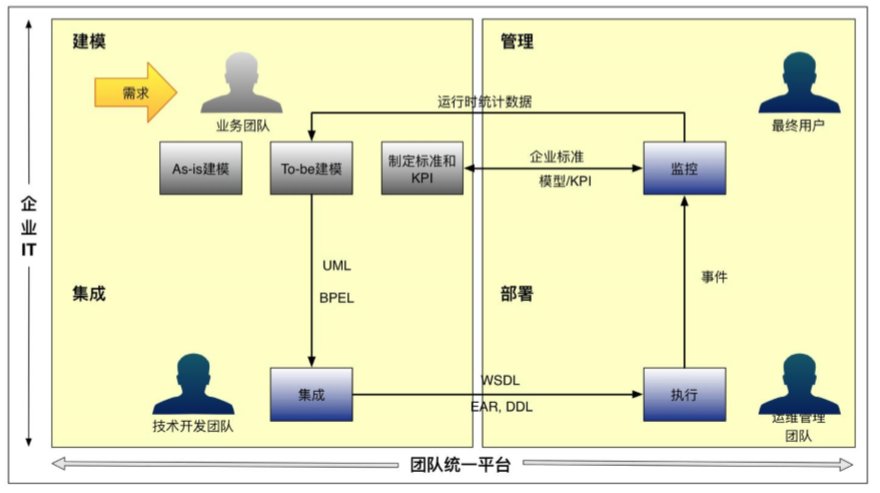

# ISAD note
课上讲的重点内容我会标记 (Important)

赶时间的话可以只看 Important 部分

# lec 1

## 1 互联网时代的软件系统

### 1.1 互联网时代软件特点
- 业务与信息紧密融合
- 规模大、并发行高
- 周期短、更新快
- 开放、普适环境

### 1.2 互联网时代的软件挑战
- 个性化的软件**需求**
- 柔性可变的软件**形态**
- 快速敏捷的软件开发**过程**
- 普适移动的软件开发、应用**环境**

## 2 互联网时代软件工程思想
- 软件**需求**
- 软件**形态**
- 开发**过程**
- 软件**验证**

### 2.1 覆盖全生命周期动态获取软件需求
- 需求主体
    - 主体不固定
- 需求获取
    - 动态获取
- 需求满足
    - 从一次性交付转变为持续优化

### 2.2 基于流程的网络服务动态集成交互（形态）
- 软件构件
    - 从功能构件构造，转变为以业务为核心的多功能处理流程
- 组装方式
    - 从功能组装集成，转换为多个服务交互实现动态组合
    - e.g. 微服务
- 运行环境
    - 从静态预设，转变为面向情景感知的自适应

### 2.3 敏捷、增量迭代的开发过程
- 过程推进
    - 阶段循序渐进开发，到各阶段边界模糊的敏捷模式
- 开发方式
    - 整体提交，到不断迭代增量开发
- 团队协作
    - 注重接口的分工合作方式，到各团队界限模糊的协同融入

### 2.4 用户体验为中心的软件验证演进
- 验证目标
    - 以功能满足为核心，转变为以用户体验为核心
- 验证方式
    - 上线的全面测试，转变为上线运行后渐进优化
- 验证内容
    - 代码的需求覆盖性测试，转变为数据挖掘分析后的模型一致性验证

## (Important) 3 互联网时代的软件工程方法框架

- 过程维度
    - 覆盖全生命周期的持续优化框架
- 形态维度
    - 微服务与容器的结合
- 管理维度
    - Scrum + DevOps

### 3.1 模型驱动的全生命周期业务建模及转换（过程维）
- 业务建模
    - 功能建模、数据建模是起点
    - 业务流程建模主流
    - 基于数据的视角
    - **业务建模**以及**模型转换**时互联网环境下软件需求描述和实现的主要方式

####（1）业务建模
- 结构建模过程
    - 用例分析，建立**用例模型** （Use Case）
    - 包图、类图、协作图等建立**业务逻辑结构**模型
    - 页面间的**跳转逻辑**分析
- 行为建模过程
    - 有限状态机对 Web 应用自顶向下划分，形成不同层次
    - 不同层面上的服务器端组件，进行依赖关系描述
- 业务建模上，传统软件系统开发存在如下困难
    - 从应用逻辑分离出流程逻辑很难
    - 业务流程需求模型的变化难以描述
    - 业务需求和软件实现之间的关联性难以建立

####（2）模型驱动体系结构（MDA）
- 基本原理是**提高抽象**的层次，以**模型驱动**方式在一个抽象层次来设计软件
- e.g. 
    - 计算无关模型 CIM 
    - 平台无关模型 PIM
    - 平台相关模型 PSM

### 3.2 基于 Web 服务的软件动态构造（形态维）
- 面向服务架构 SOA 以业务为导向
- Web 服务快速发展的原因
    - 采用广泛部署的**通信协议**，分布系统间易于通信、互操作
    - 基于文档的**消息模型**，不同类型应用间松耦合
    - 在支持互操作性的**开发标准**基础上的应用解决方案

####（1）服务组合
协调若干 Web 服务共同工作满足业务需求。
- Example
    - SpringCloud
- 难点
    - 缺乏实现**服务语义描述**的有效机制
    - 缺少高效、灵活的**服务匹配**方法
    - 缺少大规模的**自动服务组合**方法
    - Web **服务行为建模**理论薄弱

####（2）轻量级 Mashup
- **轻量级**服务组合方法，**共享已有组件**
- Example
    - 直接使用第三方 API

####（3）最终用户软件开发
- End-User Development：一组方法，技术和工具，使非专业软件开发人员用户，也可以在软件系统中，创建、修改、拓展软件的组件
- 流行的原因
    - 缩短项目完成时间
    - 软件开发工具功能更强大，易于使用

### 敏捷化的软件项目开发及运维（管理维）
- 敏捷软件开发缩小需求与开发之间的隔阂
- 敏捷软件运维模式DevOps缩小了开发与运营之间的隔阂

####（1）敏捷软件开发与Scrum
- 以人为本
- 保证质量的前提下，适度文档，适度度量
- Scrum四个主要工件
    - 产品待办事项列表
    - Sprint代办事项列表
    - 燃尽图
    - Scrum每日例会
####（2）软件运维与DevOps
- 持续集成与发布
    - SVN，Jenkins，Maven，Drone
- 自动部署
    - Puppet，Ansible，Chef，Saltstack
- 监控
    - Zabbix，Nagios，Prometheus
- 日志分析
    - Zipkin，EFK

## 4 小结
- 互联网时代软件的 特点 与 挑战
- 需求、形态、过程、验证
- 过程维度、形态维度、管理维度

# lec 2

## （Important）1 软件三种开发模式
- 定制开发
- 套件实施
- 模型驱动架构

### 1.1 基于定制开发模式的软件构造
- 含有**高事务量**或者具有**特殊业务需求**的系统
- 优势
    - 外包开发，运维服务
- 劣势
    - 人员多
    - 周期长
    - 成本高

### 1.2 基于套件实施模式的软件系统实施
- 基于一些平台，通过业务模型导引下的数据和功能配置，搭建可用系统的过程、

#### 业务蓝图 （业务参考模型）
- 描述企业业务的四个方面
    - 事件
    - 功能（任务）
    - 组织
    - 交互

- 流线式的过程描述

- 优势
    - 周期短
    - 成本低
    - 质量稳定
- 劣势
    - 受软件已有功能和架构的限制，部分特别需求难以瞒住

### 1.3 业务模型驱动的软件架构模式
- 构建业务模型的基础上，通过模型驱动的转换，实现软件架构，进而构造出可运行的软件
- 改善整体业务，易于调整适应业务变化

## 2 软件架构的演化

### 2.1 架构
- 单机系统
- 数据库系统
- 三层架构 C/S, B/S 加数据库
- 工作流系统
- 多层架构
- 云架构

### 2.2 MVC 模式的互联网架构

- 经典多层 

### （Important）2.3 以业务为中心的微服务架构
- 一种架构风格
    - 将大型的复杂业务分为多个微服务
    - 松耦合，可被独立部署
    - 服务计算的一种优化实现方式
- 特性
    - 基于服务的应用组件化
    - 围绕业务能力组织微服务
    - 按产品而非项目划分微服务
    - 强调智能端点和管道扁平化
    - 分散式管理
    - 分散式数据
    - 基础设施自动化
    - 基于故障的设计
    - 演进的设计
-----------------------
| 单体架构 | 微服务架构 |
|---------|-----------|
| 整体部署  | 拆分部署 |
| 紧耦合  | 松耦合 |
| 基于整个系统的扩展 | 基于独立服务，按需扩展 |
| 集中式管理 | 分布式管理 |
| 应用无依赖关系管理 | 微服务间较强的依赖关系管理 |
| 局部修改，整体更新 | 局部修改，局部更新 |
| 故障全局性 | 故障隔离，非全局 |
| 代码不易理解，难维护 | 代码易于理解维护 |
| 开发效率低 | 开发效率高 |
| 资源利用率低 | 资源利用率高 |
| 重，慢 | 轻，快 |

#### 微服务架构的问题
- 开发人员技能要求高 
- 接口的数目和匹配问题 
- 分布式系统复杂性 
- 可测性的挑战 
- 异步机制 
- 代码重复 
- 运维开销及成本增加

因此只有当系统复杂度持续增加，业务对技术的支撑需求和预期加强时，考虑微服务才是合理的。

## 3 面向互联网的软件过程
- 互联网环境下的软件过程：
    - 覆盖全生命周期的 持续集成框架
- 从用户出发
    - 基于用户应用流程的逐步推演过程

### 3.1 (Important)基于流程的软件系统实施过程
围绕业务流程生命周期的模型构建与转换，也是基于业务流程的管理活动，也提供了软件实施步骤和任务划分的基础。

- 基于 WebSphere 套件支持业务流程的管理
- 四个主要组件对应四个阶段
    - 建模
        - 使用 WebSphere Business Modeler 收集需求，设计，建模，仿真，优化业务模型
    - 装配
        - 在建模基础之上，采用 WebSphere Integration Developer 建立模型和组件、资源的映射关联，实现系统配置
    - 部署
        - 采用 WebSphere Process Server 对所有基于 SOA 的流程自动化
    - 管理
        - 采用 WebSphere Business Monitor 实现流程运行的动态管理
### 3.3 软件开发相关角色及职责
- 开发相关
    - 业务类
        - 业务咨询师
    - 开发类
        - 系统架构师
        - 系统开发人员
        - 系统测试人员
    - 运维类
        - 系统运维人员
- 管理类
    - 项目经理
    - 产品经理

## 4 小结
- 软件开发模式的定制开发-套件实施-模型驱动架构 比较分析；
- 阐述了软件架构的演化历程，结合互联网环境阐述 了经典多层架构的内容，以及微服务架构的主要特点；
- 阐述了基于流程的软件开发实施过程，相关的工具支撑，以及相关主要角色的职责和任务。

# lec 3